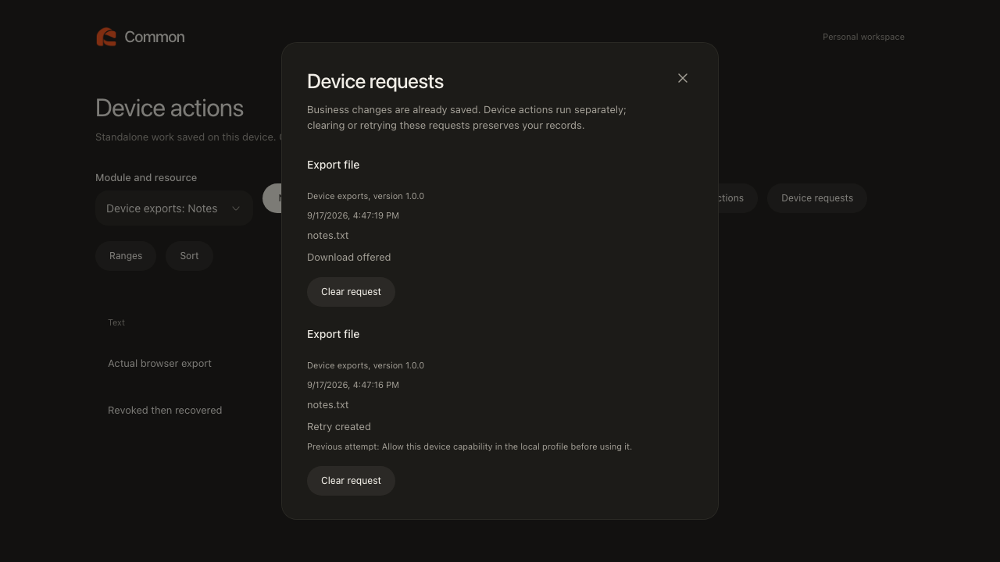
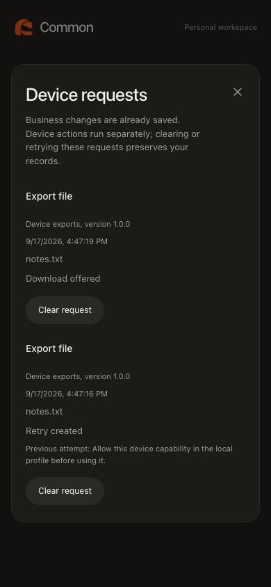
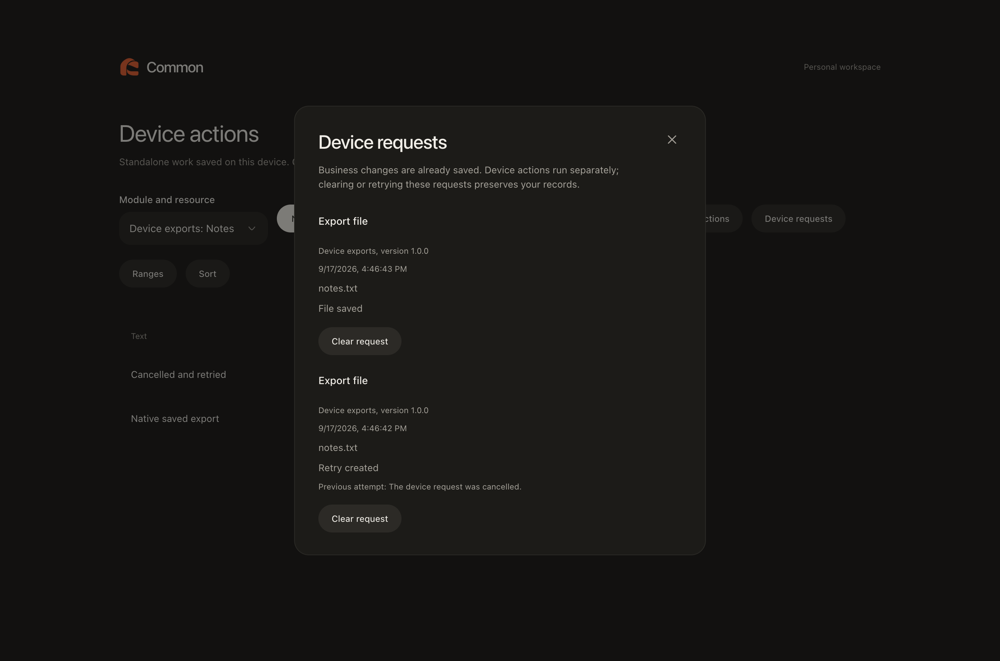

# Standalone device effects and recovery controls

17 September 2026. SDK-05 remains active. This milestone connects the encrypted request journal to actual browser downloads and native file writes, with owner-facing processing and recovery controls.

## Implementation

- The [host adapter](../../../packages/client/src/adapters/local-devices.ts) checks the live profile guard before effects and after permission prompts. Browser exports offer a real download; notification requests use supported browser permission checks.
- [Native sessions](../../../apps/desktop/src/main/local-device-sessions.ts) bind immutable profile, grant, release and request metadata to bounded, single-use handles. Fresh nonces challenge the unlocked profile host before execution and after save dialogs. Closing, cancellation, navigation, renderer loss and late replies cannot authorize a later write.
- [Native effects](../../../apps/desktop/src/main/local-devices.ts) own the file chooser and filesystem write. A module supplies a validated filename and content, never an arbitrary destination path. New files use mode 0600. Local profiles never borrow authenticated corporate LAN transport.
- [Request controls](../../../packages/shell/src/features/modules/local/devices/requests.tsx) distinguish saved business work from pending, completed, rejected and uncertain device outcomes. They provide cancellation, explicit review before uncertain retry, linked device-only retries, async clearing feedback and interrupted-profile recovery instructions. Clearing requests preserves records.
- Local operation feedback identifies newly queued requests without claiming device success. Existing host components and styles are reused.

## Observable acceptance

| Check                                                                                 | Result               |
| ------------------------------------------------------------------------------------- | -------------------- |
| Headless device effects, existing consent and journal/recovery journeys               | 3 passed             |
| Hidden native actual effects and cross-session revocation journey                     | 1 passed             |
| Existing hidden corporate host-capability regression after fixture refresh correction | 1 passed             |
| Scoped Axe and root overflow checks at 1280 and 390 pixels                            | Passed               |
| Wide, narrow and native captures                                                      | Inspected            |
| Strict types, environment and architecture checks, production builds                  | Passed; all 4 builds |

Final focused unit verification passed **45 tests across 10 files**, covering local workers, grants, services, requests and native sessions, plus corporate host contracts. Log: `/tmp/gabs-device-effects-unit-final.log`.

The [browser journey](../../../tests/e2e/local-device-effects.spec.ts) installs an independently built, reviewed and signed module, queues work through its real worker while offline, verifies downloaded bytes, revokes/renews consent and retries without duplicating business records. Existing consent and journal tests also passed, including owning-page termination and recovered uncertainty.

The [native journey](../../../tests/desktop/local-device-effects.spec.ts) verifies real IPC, challenge callbacks, filesystem content and new-file permissions. A held save is cancelled, then explicitly retried with keyboard acknowledgement. A second real session changes consent in the same encrypted vault during another held save; releasing it cannot write. Lock/unlock recovers uncertainty and preserves exactly one business record. All windows remain hidden/minimized and unfocused.

Initial attempts exposed async fixture assumptions: checkbox state changes only after encrypted persistence, the module manager remembers its current panel, and clearing must await removal. Controls now show clearing progress. The corporate regression initially reused a renderer policy snapshot after a direct database regrant; explicit reload now matches its existing browser counterpart. The corrected journeys passed without weakening effect or revocation assertions.

## Limits

Native save-dialog choices are controlled in the test so no OS dialog interrupts the user; IPC and file writes are real. Cancellation invalidates write authority but does not promise dismissal of an OS dialog. Native test mode suppresses OS notifications. Real OS notification presentation, web push and positive authorized corporate LAN acceptance remain open.

The trusted profile host verifies the encrypted vault, signed release and current consent. Native main validates and binds its descriptor and requires fresh host callbacks; it does not independently decrypt the vault or protect against a compromised renderer/OS. Official module code remains reviewed trusted code. These local grants never authorize corporate business changes.

Corporate offline capability leases, standalone development simulation, official adapter audit and administrator capability review remain required under the [SDK-05 map](../../sdk-05-acceptance.md). No full-suite, remote CI, signed release or final UI approval is claimed here. Historical captures were restored.

Logs: `/tmp/gabs-device-effects-build-final.log`, `/tmp/gabs-device-effects-browser-regression.log`, `/tmp/gabs-device-effects-native-final.log`, `/tmp/gabs-device-effects-native-regression-final.log`.

## Captures

