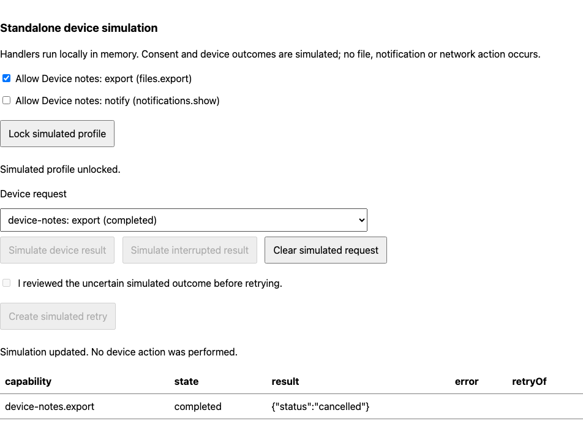
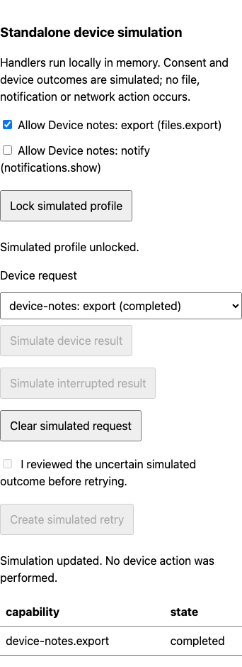

# Standalone capability development simulation

17 September 2026. SDK-05 remains active. Standalone handlers, consent and queued-device recovery now have scoped development acceptance through the public SDK, CLI and preview.

## Implementation and authoring

- [Simulation fixtures](../../../packages/sdk/src/testing/simulation-fixtures.ts) accept `personal`, a matching `local` implementation, inferred `deviceAccess` aliases and capability-specific `hostResults`. Missing consent is denied. A mismatched local contract or undeclared capability fixture fails validation.
- The [standalone simulator](../../../packages/sdk/src/testing/simulation-local.ts) uses the actual local transaction runtime. Records, participant records, receipts and bounded device requests commit atomically. Consent, service grants, read grants, permissions, lock changes and cancellation are checked before committing. Provider services require their own device consent.
- The [public simulator](../../../packages/sdk/src/testing/simulator.ts) exposes an inferred `localClient`, consent setters, device processing, interruption, reviewed retry, clearing and simulated lock/unlock. It shares resource snapshots with the existing inspector and preserves standalone execution while the simulated server is offline.
- The [CLI loader](../../../tooling/modules/simulation.ts) discovers `module-local.ts`; authored scenarios do not need to duplicate or mock handlers. [Example scenarios](../../../tests/fixtures/local-device-simulation/module.scenarios.ts) run through `pnpm module test tests/fixtures/local-device-simulation`.
- The development preview exposes root/provider consent, configured host results, pending/completed/rejected/uncertain outcomes and explicit review controls. It distinguishes standalone saved work from simulated server acceptance. Source changes create a fresh worker and reset the simulation; old-generation actions are rejected.

## Verification

| Check                                                                          | Result                          |
| ------------------------------------------------------------------------------ | ------------------------------- |
| Focused local/runtime/simulator/scenario/CLI unit suite                        | 64 tests passed across 16 files |
| Authored standalone CLI scenarios                                              | 2 passed                        |
| Corporate host, provider services and stateful custom-view preview regressions | 3 passed                        |
| Standalone preview after hot-reload readiness correction                       | 1 passed                        |
| Scoped Axe at 1280 and 390 pixels; root overflow                               | Passed                          |
| Wide and narrow development-control captures                                   | Inspected                       |

The [unit tests](../../../tests/unit/local-simulator.test.ts) verify real handler execution, offline writes, denied and renewed consent, receipt replay, completed-result replay, interrupted-outcome review, record preservation, provider-owned consent, rollback, journal limits and changed consent during a suspended handler. Compile-time checks reject invalid capability aliases, results, resources and operation inputs.

The [headless journey](../../../tests/e2e/local-device-simulator.spec.ts) exercises denial, keyboard acknowledgement, interruption, lock/unlock, retry and configured results. It proves source reload resets prior records/requests, installs new consent fixtures and rejects stale-generation actions. No download event occurs. The first run completed device recovery but inspected state before the new worker was ready; the corrected test waits for both worker readiness and the renderer's matching generation. The three existing preview regressions passed on the initial run. Historical captures were restored.

Final strict TypeScript checks, browser/Node/preload/worker boundaries, architecture/copy checks and all four production builds passed. Log: `/tmp/gabs-local-simulation-build-final.log`.

## Scope limits

Only business handlers use the real standalone runtime here. Device results, profile locks and interruption are explicitly simulated in development memory. This is not encrypted persistence, signature verification, real crash recovery, native notification presentation or LAN transport acceptance. Simulated consent has no production authority. Actual browser/native file effects retain their separate [acceptance evidence](../local-device-effects/README.md).

Corporate offline host leases, official module adapter audit, administrator capability review, positive native LAN and supported notification presentation remain open in the [SDK-05 map](../../sdk-05-acceptance.md). No platform parity or final product UI approval is claimed.

Logs: `/tmp/gabs-local-simulation-unit-final.log`, `/tmp/gabs-local-simulation-cli.log`, `/tmp/gabs-local-simulation-browser.log`, `/tmp/gabs-local-simulation-browser-final.log`.

## Captures

